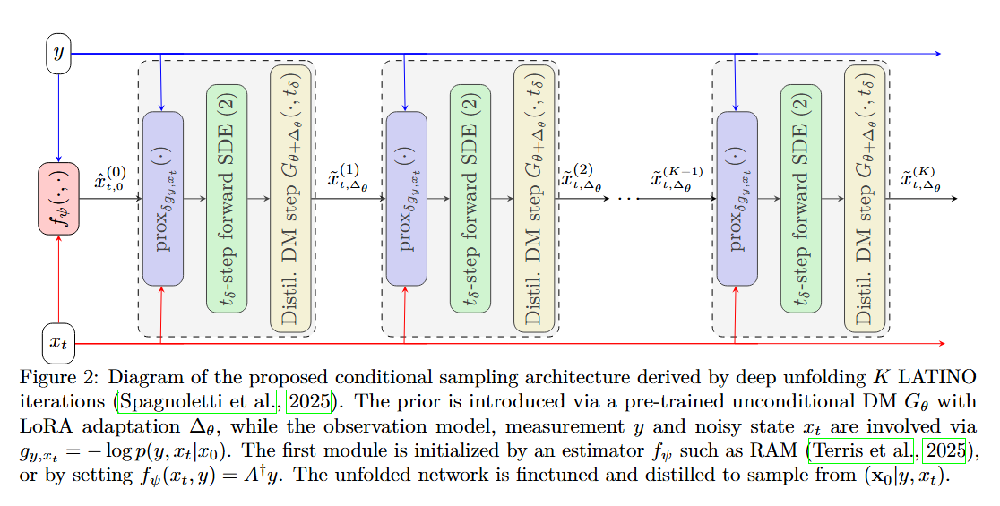
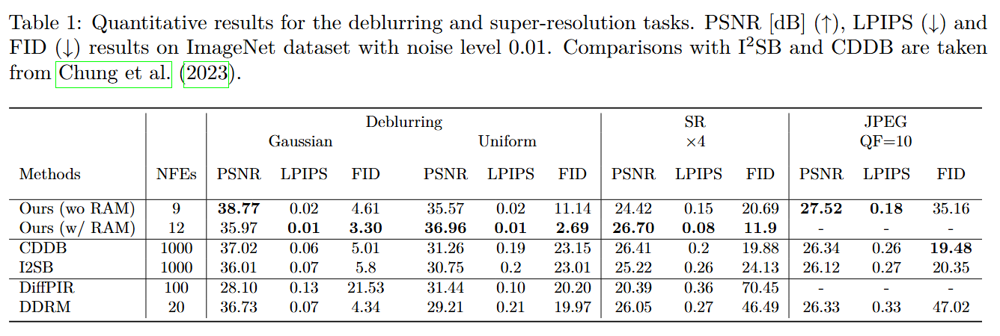
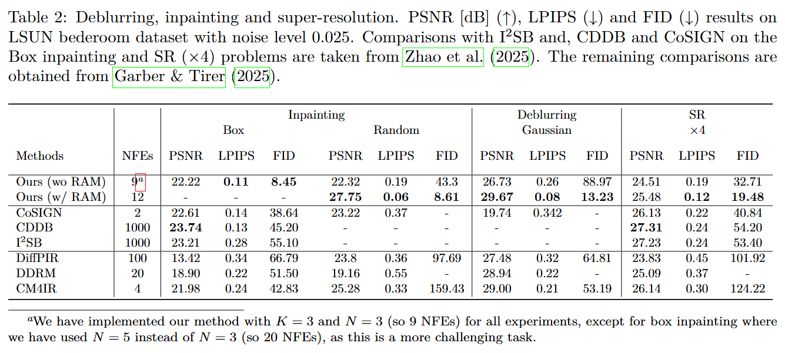

# [Learning few-step posterior samplers by unfolding and distillation of diffusion models](https://arxiv.org/abs/2305.08995)

[Charlesquin Kemajou Mbakam](https://charles-kmc.github.io/), [Jonny Spence](), [Marcelo Pereyra](https://www.macs.hw.ac.uk/~mp71/index.html).

This repository contains the code and data associated with the paper "Learning few-step posterior samplers by unfolding and distillation of diffusion models".

This code is based on the [OpenAI Guided Diffusion](https://github.com/openai/guided-diffusion).


**Contents**
- [Learning few-step posterior samplers by unfolding and distillation of diffusion models](#learning-few-step-posterior-samplers-by-unfolding-and-distillation-of-diffusion-models)
  - [Abstract](#abstract)
  - [Setting UP](#setting-up)
    - [Clone and Install](#clone-and-install)
    - [Model Download](#model-download)
    - [Inference Code](#inference-code)
  - [Algorithm](#algorithm)
  - [Results](#results)
    - [Quantitative Results](#quantitative-results)
    - [Qualitative Results](#qualitative-results)
  - [Citation](#citation)
  - [Acknowledgments](#acknowledgments)

## Abstract

Diffusion models (DMs) have emerged as powerful image priors in Bayesian computational imaging. Two primary strategies have been proposed for leveraging DMs in this context: Plug-and-Play methods, which are zero-shot and highly flexible but rely on approximations; and specialized conditional DMs, which achieve higher accuracy and faster inference for specific tasks through supervised training. In this work, we introduce a novel framework that integrates deep unfolding and model distillation to transform a DM image prior into a few-step conditional model for posterior sampling. A central innovation of our approach is the unfolding of a Markov chain Monte Carlo (MCMC) algorithm—specifically, the recently proposed LATINO Langevin sampler—representing the first known instance of deep unfolding applied to a Monte Carlo sampling scheme. We demonstrate our proposed unfolded and distilled samplers through extensive experiments and comparisons with the state of the art, where they achieve excellent accuracy and computational efficiency, while retaining the flexibility to adapt to variations in the forward model at inference time.

## Setting UP
### Clone and Install
```bash
git clone https://github.com/charles-kmc/UD2M.git
cd UD2M
pip install -r requirements.txt
```

## Model Download
Download the pretrained checkpoints used in this project from the following link:

Access our fine-tuned checkpoint models here [Link]().

## Training and Inference Code
The parameters have to be configured in the bash script. The models were trained and evaluated on multiple restoration tasks, including `deblurring (deblur)`, `single image super resolution (sisr)`, `inpainting (inp_random_box)`, `JPEG artifact removal (jpeg)` and `general operator (general_operator)`.

### Training scripts
Run the training script for a specific task:
```bash
sbatch ./scripts/t<task_name>.sh
```
Example for deblurring:
```bash
sbatch ./scripts/tdeblur.sh
```
### Inference scripts
Run the inference script:
```bash
sbatch ./scripts/sampling.sh
sbatch ./scripts/sampling_jpeg.sh
```

## Algorithm 
The overall unrolling dinoising diffusion models is summarised as follows.
<p align="center">
  
</p>

For more details, feel free to check the related [paper](https://arxiv.org/abs/2305.08995)

## Results
### ImageNet
The table below presents the performance metrics for models evaluated on the ImageNet dataset.
<p align="center">
  
</p>

### LSUN
The table below presents the performance metrics for models evaluated on the LSUN dataset.
<p align="center">
  
</p>

## Citation
If you find this repo helpful, please cite:

```
@article{mbakam2025learning,
  title={Learning few-step posterior samplers by unfolding and distillation of diffusion models},
  author={Mbakam, Charlesquin Kemajou and Spence, Jonathan and Pereyra, Marcelo},
  journal={arXiv preprint arXiv:2507.02686},
  year={2025}
}
```


## Acknowledgments
```This work was supported by UKRI Engineering and Physical Sciences Research Council. We acknowledge the use of the HWU high-performance computing facility (DMOG) and associated support services in the completion of this work..```